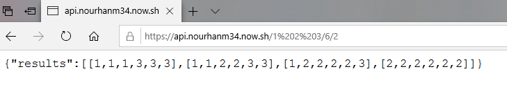

# Combinational_numbers_backend_ python

# This code make that :

  take 3 input (list , len of numbers , avg target ) and the output is the lists that achieve the avg target and their len = len of         numbers that is in input.
  
  such as :
    if input is (1 2 3 , 6 , 2 )
    the output is [1,1,1,3,3,3] , [1,1,2,2,3,3] , [1,2,2,2,2,3] , [2,2,2,2,2,2]
    
# Prerequisites :

1- install Python

2-I use Flask is a microframework for Python, Setup with the command:

  >>> pip install Flask

# Running for test :

* This code return jsonify .

# Deployment :

Deployed on now-Zeit on the link:
  https://api.nourhanm34.now.sh/ 
